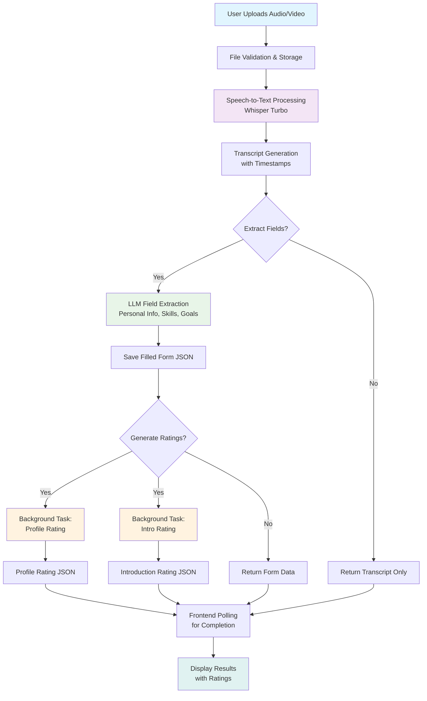

# ConvAi-IntroEval Project Overview

This is a self-introduction evaluation system that processes audio/video introductions through a three-stage pipeline. Here's a breakdown of each file and the workflow:

## File Descriptions

### Core Processing Files

**stt.py** - Speech-to-Text Module
- Uses OpenAI Whisper (turbo model) for audio transcription
- Converts audio/video files to timestamped text transcripts
- Supports multiple formats: mp3, mp4, wav, m4a, webm, flac, ogg, aac
- Outputs formatted transcripts with timestamps

**main.py** - FastAPI Web Application
- Main application entry point with REST API endpoints
- Handles file uploads, processing coordination, and streaming responses
- Manages directories for videos, transcripts, forms, and ratings
- Provides real-time Server-Sent Events (SSE) for frontend updates

### LLM Processing Module (`app/llm/`)

**`form_extractor.py`** - Field Extraction
- Extracts structured information from transcripts using LLM
- Identifies personal details, background, skills, goals from spoken introductions
- Supports both synchronous and streaming processing

**`profile_rater_updated.py`** - Profile Rating
- Evaluates the completeness and quality of extracted profile information
- Provides scoring and feedback on personal introduction content

**`intro_rater_updated.py`** - Introduction Rating
- Analyzes the overall quality of the spoken introduction
- Evaluates delivery, structure, clarity, and engagement

**`utils.py`** - Utility Functions
- Helper functions for file management and LLM operations
- Handles latest file retrieval and data processing utilities

### Frontend Files

**Templates:** `index.html` - Main web interface
**CSS:** `styles.css`, `rating-styles.css` - Styling
**JavaScript:** `app.js`, `rating-utils.js` - Frontend logic

## Workflow Diagram

## Data Flow

### Directories Structure
- **`videos/`** - Uploaded audio/video files
- **`transcription/`** - Generated transcript files
- **`filled_forms/`** - Extracted structured data (JSON)
- **`ratings/`** - Generated rating files (JSON)

### API Endpoints
- **`POST /transcribe`** - Main processing endpoint
- **`GET /extract-fields-stream`** - Streaming field extraction
- **`GET /profile-rating-stream`** - Streaming profile rating
- **`GET /intro-rating-stream`** - Streaming intro rating
- **`GET /ratings/check_status`** - Poll for rating completion

### Processing Flow
1. **Upload & Transcribe** - Convert audio to text using Whisper
2. **Extract Fields** - Use LLM to structure transcript into form data
3. **Generate Ratings** - Parallel evaluation of profile and introduction quality
4. **Stream Results** - Real-time updates to frontend via Server-Sent Events

The system is designed for asynchronous processing with background tasks for time-consuming LLM operations, while providing immediate feedback through streaming responses.